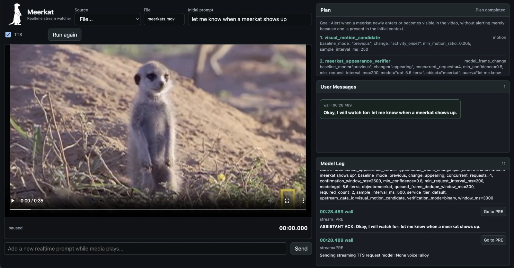
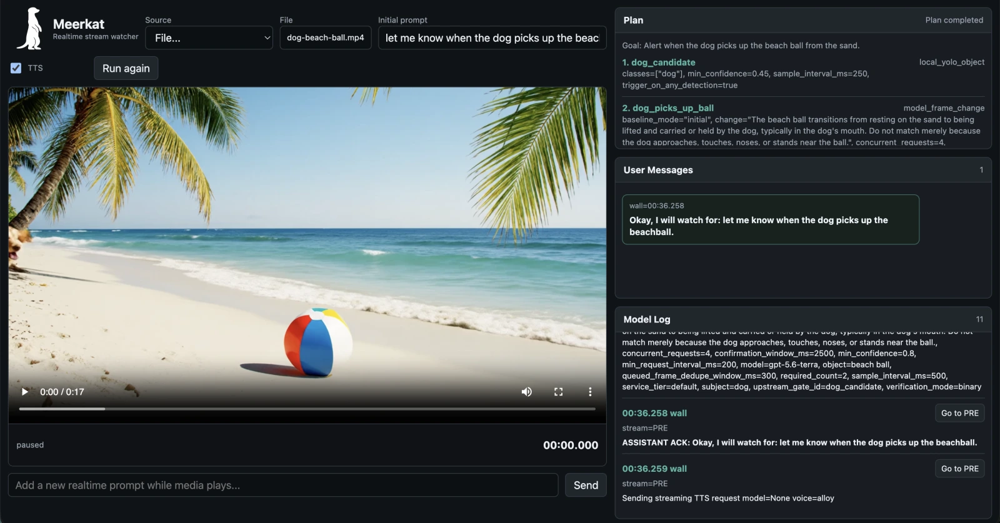
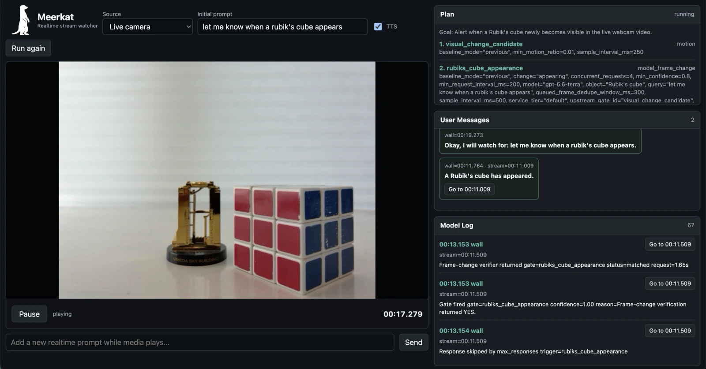
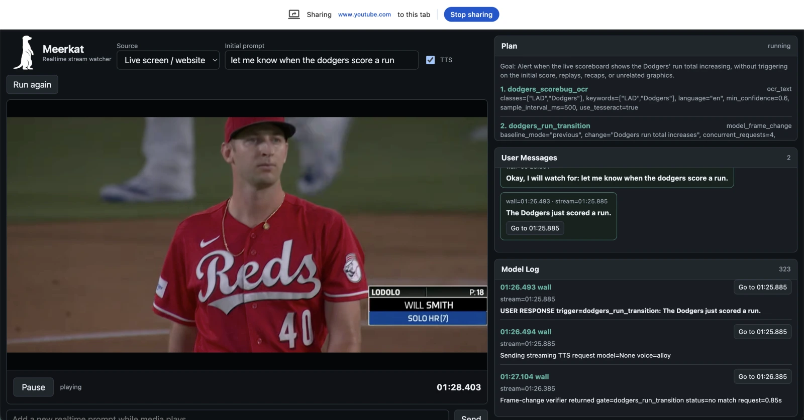
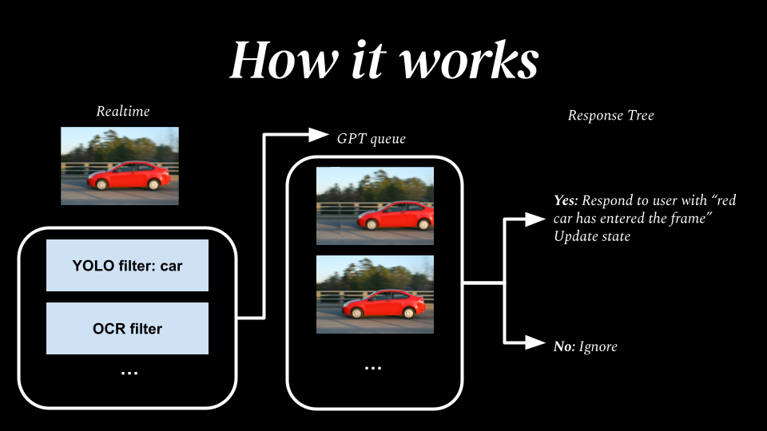

<div align="center">
  
  <h1>Meerkat</h1>
  <p><strong>Say what you want to be told about. Meerkat watches the stream for you and keeps you informed.</strong></p>
</div>

<div align="center">
  
</div>

```bash
uv run meerkat "let me know when someone leaves the front door open" --media doorcam.mp4
```

```text
   0.00: Video starts playing stream=0.00s
   4.83: Gate fired gate=cheap_object_candidates confidence=0.71 reason=Detected person, door stream=4.80s
   4.84: Sending vision verifier request gate=verify_door_state model=gpt-5.6-luna mode=binary
   5.42: Vision verifier returned gate=verify_door_state status=matched confidence=1.00 request=0.58s
   5.42: USER RESPONSE trigger=verify_door_state: The front door was left open. stream=4.80s
```

Every line carries both the wall time it happened and the media time it is
about, because those are not the same number.

---

## What it is

Ask a multimodal model about a video today and you are doing **batch
question-answering**: upload the whole clip, wait, read the answer. That does
not work for a stream. A stream does not end, you do not know in advance which
second matters, and sending every frame to a large model is both too slow and
too expensive to keep up with real time.

Meerkat is built for **streams that are running live**, using a funnel of cheap gates running continuously in real time (e.g. object detection, motion, OCR, speech to text) that fire to signal candidate moments, and smarter, more expensive models that confirm and verify.

Your natural language request is also turned into a pre-built response tree that the model can fill in, to minimize latency.

A funnel only speaks when its condition is actually confirmed, and never repeats itself. Ask "how many fingers am I holding up" and it reports `2 fingers` once, stays quiet while the answer holds, and speaks again the moment it becomes `4`.

The result is a monitor you can leave running on a live camera, microphone,
screen share, or a file.

## Install

Requires Python 3.9+ and [uv](https://docs.astral.sh/uv/).

```bash
uv sync
```

Local OCR needs the Tesseract binary, which is an OS package rather than a
Python one:

```bash
brew install tesseract        # macOS
sudo apt install tesseract-ocr  # Debian/Ubuntu
```

Then provide **one** API key, in the environment or in a `.env` file at the
project root (see [`.env.example`](.env.example)):

```bash
OPENAI_API_KEY=...       # or ANTHROPIC_API_KEY=... or FIREWORKS_API_KEY=...
```

Meerkat works with OpenAI, Anthropic, or Fireworks and picks whichever key it
finds, see [Providers](#providers). Detector weights are downloaded
automatically the first time a local vision gate runs.

## Use it

### Command line

```bash
uv run meerkat "<what to watch for>" --media <file>
```

The prompt is ordinary English. Some things it handles:

```bash
# an event in video
uv run meerkat "let me know when a package is dropped off" --media porch.mp4

# a value that appears on screen
uv run meerkat "what number is on the runner's bib? tell me as soon as you find out" --media race.mp4

# something said out loud (audio-only files skip video decoding entirely)
uv run meerkat "let me know when anyone mentions a refund" --media call.mp3

# a running count, kept in funnel state
uv run meerkat "count how many people walk past and tell me the running total" --media sidewalk.mp4

# add prompts from stdin while the stream is still playing
uv run meerkat "tell me when the light turns green" --media traffic.mp4 --live-prompts

# speak the answers out loud
uv run meerkat "let me know when the kettle starts whistling" --media kitchen.mp4 --speak-play
```

`--media` takes video or audio-only files. Add `--no-planner` to skip planning
and send the prompt straight to a single verifier, and run
`uv run meerkat --help` for the full set of sampling and queueing flags.

Three short clips ship with the repo, so there is something to point it at
before you have media of your own:

```bash
uv run meerkat "let me know when the dog picks up the beach ball" --media examples/media/dog-beach-ball.mp4
```

See [`examples/`](examples/README.md) for the rest.

### Web UI

```bash
uv run meerkat-web
```

Open <http://127.0.0.1:8000> and pick a source:

- **File**: choose a video or audio file from your machine; the browser
  uploads it and playback starts from there.

  

- **Live camera**: webcam frames and microphone audio, streamed from the
  browser.

  

- **Live screen / website**: a shared screen, window, or browser tab, which
  makes this a way to watch a web page for changes.

  

### As a library

```python
import asyncio

from meerkat.funnel.spec import FunnelSpec
from meerkat.ingest.sources import VideoFileSource
from meerkat.models.responders import LocalResponder
from meerkat.runtime.runner import StreamRunner

spec = FunnelSpec.video_query(
    goal="Is the door open?",
    on_match_text="The door is open.",
    sample_interval_ms=500,
)
runner = StreamRunner(
    source=VideoFileSource("doorcam.mp4"),
    spec=spec,
    responder=LocalResponder(),
)
for response in asyncio.run(runner.run()):
    print(response.text)
```

Subscribe to `runner.bus` to consume alerts as they happen instead of
collecting them at the end, see [`examples/watch_stream.py`](examples/watch_stream.py).

## How it works

<div align="center">
  
</div>

### The funnel

A `FunnelSpec` is a goal, a list of `GateSpec`s, and a `ResponseSpec`.

The response tree keeps the final hop cheap. A binary verifier answers only
`YES` or `NO`, and `YES` maps to pre-written text:

```text
YES -> "The front door was left open."
NO  -> ignore
```

In extraction mode the verifier returns a value instead, which the response
text interpolates (`"Bib number: {evidence.text}"`). Funnels can also carry state for counts and running natural-language notes, referenced as `{state.<key>}`.

A confirmed firing only leads to a user-facing message if it is not repetitive or if there is some change. A prompt asking about a single occurrence ("let me know when a person appears") is answered once. One asking for ongoing updates ("every time", "whenever",
"keep me updated", "when X changes") keeps reporting.

### Gates

| Kind | Gates |
| --- | --- |
| Local vision | `local_yolo_object`, `local_yolo_segmentation`, `local_yolo_pose`, `local_image_classification`, `object_label`, `object_track`, `motion`, `color_presence`, `object_spatial_relation`, `ocr_text` |
| Local audio | `local_realtime_transcription`, `transcript_keyword`, `audio_volume`, `audio_pitch`, `audio_cadence` |
| Temporal | `temporal_count`, `temporal_join` |
| Model-backed | `model_vision_object`, `model_vision_query`, `model_frame_change`, `model_state_monitor`, `model_transcript_query`, `hosted_transcription` |

Temporal gates are what turn a noisy per-frame signal into an event: require
*n* firings inside a window (`temporal_count`), or require two gates to fire
close together (`temporal_join`) for conditions like "a person appears while
that phrase is spoken".

When a gate fires, the candidate moment is placed in a queue, with a minimum interval between requests. After the stream ends, the runner keeps draining in-flight work before reporting.

### Model tiers

Each provider supplies its own defaults for the four tiers the planner chooses
between. Pin any of them if you want a specific model:

| Variable | Used for |
| --- | --- |
| `MEERKAT_PLANNER_MODEL` | Compiling the request into a funnel, and hard verification. |
| `MEERKAT_CHEAP_MODEL` | Simple yes/no verification. |
| `MEERKAT_MID_MODEL` | Moderately ambiguous verification. |
| `MEERKAT_RESPONDER_MODEL` | Optional model-phrased responses (`--model-responder`). |

The planner picks among these tiers per gate, preferring the cheapest one that
can settle the question.

Fireworks model ids are account paths, and its serverless catalogue turns over
quickly. List what is actually callable with your key:

```bash
curl -s https://api.fireworks.ai/inference/v1/models \
  -H "Authorization: Bearer $FIREWORKS_API_KEY" | jq '.data[] | {id, supports_image_input}'
```

## Development

```bash
uv sync --extra dev
uv run pytest
```

## Built on

Meerkat is a system built around existing open models and libraries; the
components doing the perception work are theirs:

- **[Ultralytics YOLO](https://github.com/ultralytics/ultralytics)**
- **[faster-whisper](https://github.com/SYSTRAN/faster-whisper)**
- **[Tesseract](https://github.com/tesseract-ocr/tesseract)** via
  [pytesseract](https://github.com/madmaze/pytesseract)
- **[PyAV](https://github.com/PyAV-Org/PyAV)** (FFmpeg) and
  **[OpenCV](https://opencv.org/)**
- **[FastAPI](https://fastapi.tiangolo.com/)** and
  **[Uvicorn](https://www.uvicorn.org/)**

## License

[MIT](LICENSE).
